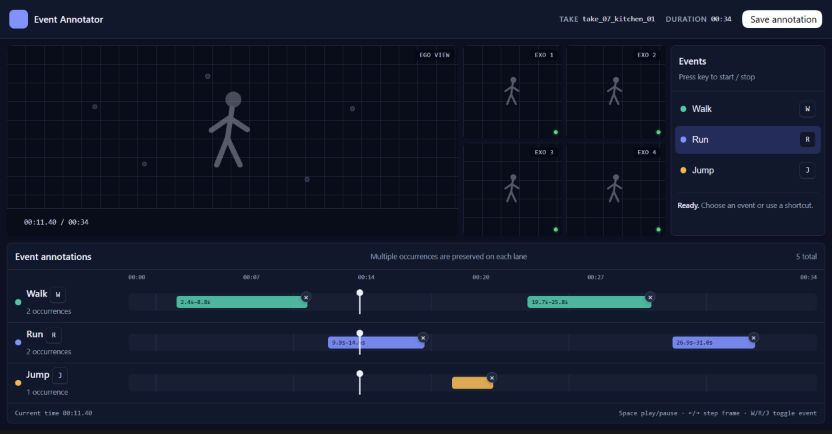

# Multi View Multi Class Event Localizer

A desktop-first research annotation application for localizing multiple temporal event classes across synchronized video views on one shared timeline.

**Status:** v1 release candidate. Configuration, manifest discovery, synchronized playback, annotation editing, atomic persistence, sequential navigation, resume, and completion are implemented. See [the release-readiness audit](docs/release-readiness-audit.md) for verified criteria and remaining environment-dependent checks.

## Demo

> 🎥 **Demo video coming soon**
>
> A complete annotation workflow demonstration will be added here.

## Interface

## Core functionality

- Reads exact take order from a configured XLSX manifest.
- Keeps one to five configured video views in fixed positions under one play/pause and seek controller.
- Generates the event panel and vertically scrollable annotation lanes from validated JSON configuration.
- Supports multiple non-overlapping occurrences per event class, simultaneous classes, cross-class overlap, 0.1-second precision, auto-close, edge dragging, delete, and Cancel Active.
- Saves one completed entry per take to a validated JSON document using same-directory atomic replacement and stale-file detection.
- Protects unsaved work, resumes the first incomplete take, and shows completion only after every manifest take is saved.

## Typical workflow

Start the application, review the fixed synchronized views, and use the shared playback controls to locate an event boundary. Click an event or press its shortcut to open and close occurrences. Refine completed intervals by dragging their edges, then choose **Save & Next**. Previous and Next retain XLSX order; a dirty-state confirmation prevents accidental loss. An empty take can be saved only after explicit confirmation.

## Architecture

The application is one Next.js repository and one Node.js process. Server-only modules validate environment configuration and event definitions, read the XLSX manifest, resolve and range-stream configured media, and own annotation persistence. Browser components receive narrow path-free data and keep shared playback and unsaved annotation state local. See [the architecture notes](docs/architecture.md).

## Configuration and setup

Use [SETUP.md](SETUP.md) as the authoritative guide for prerequisites, environment variables, dataset layout, XLSX requirements, event configuration, permissions, development, production, LAN operation, and troubleshooting.

## Technology stack

TypeScript, Next.js App Router, React, Zod, ExcelJS, CSS custom properties, Vitest, ESLint, and pnpm. Normal operation requires no database, authentication service, cloud service, or public internet connection.
